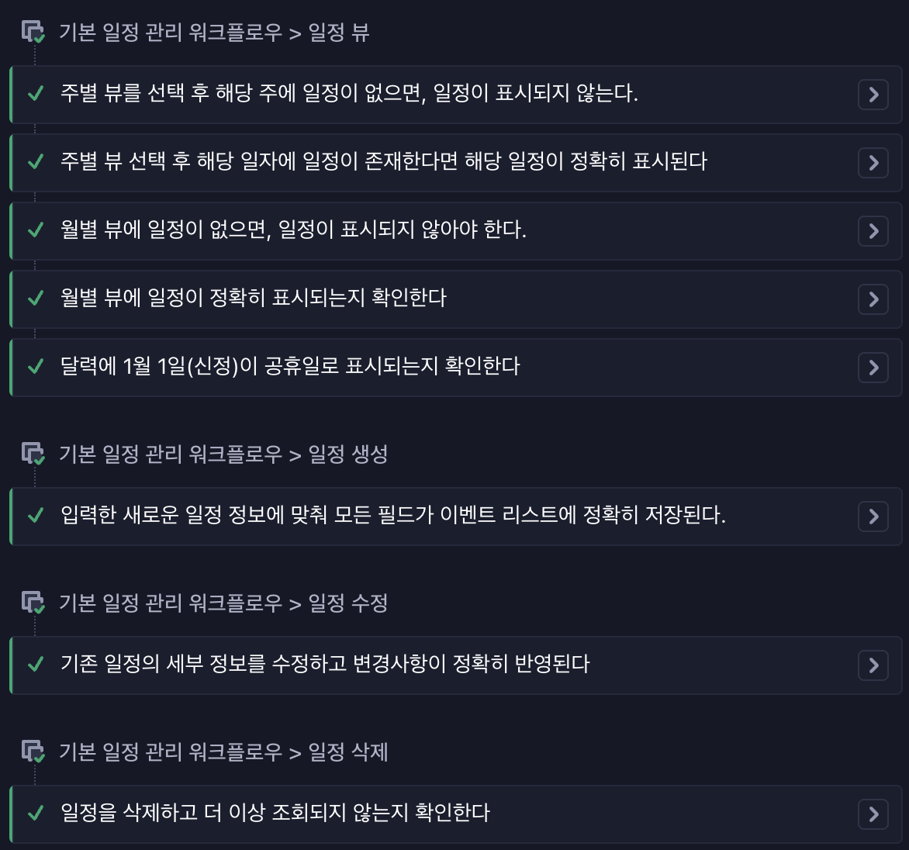
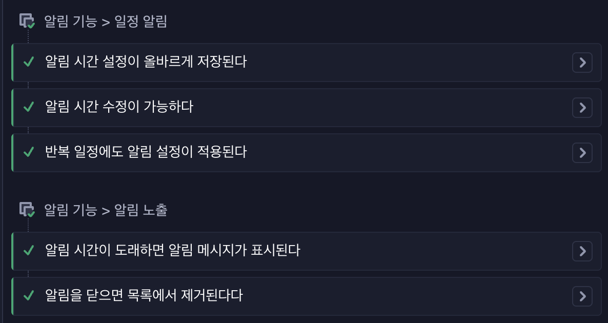
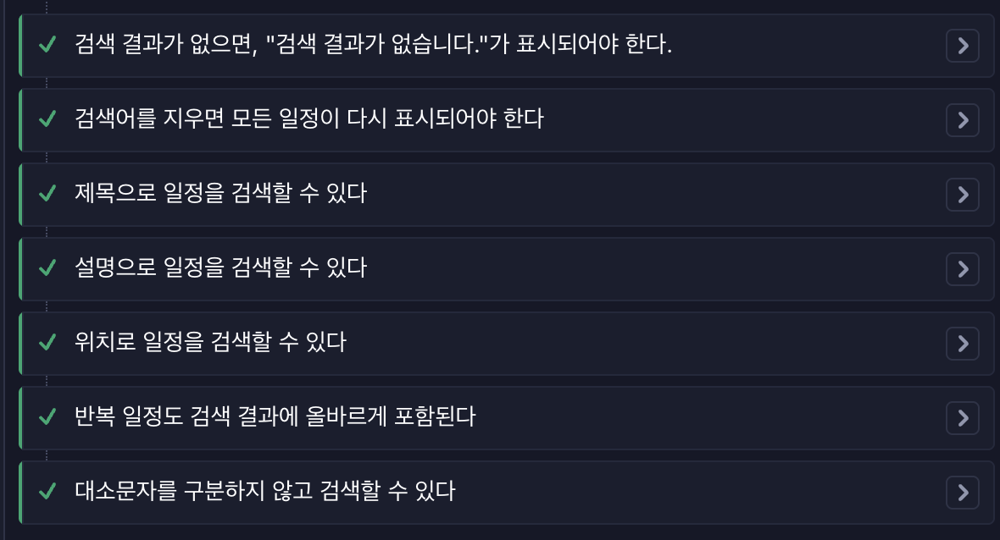
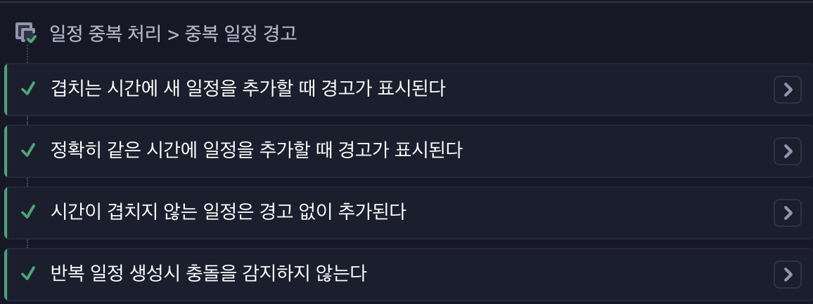
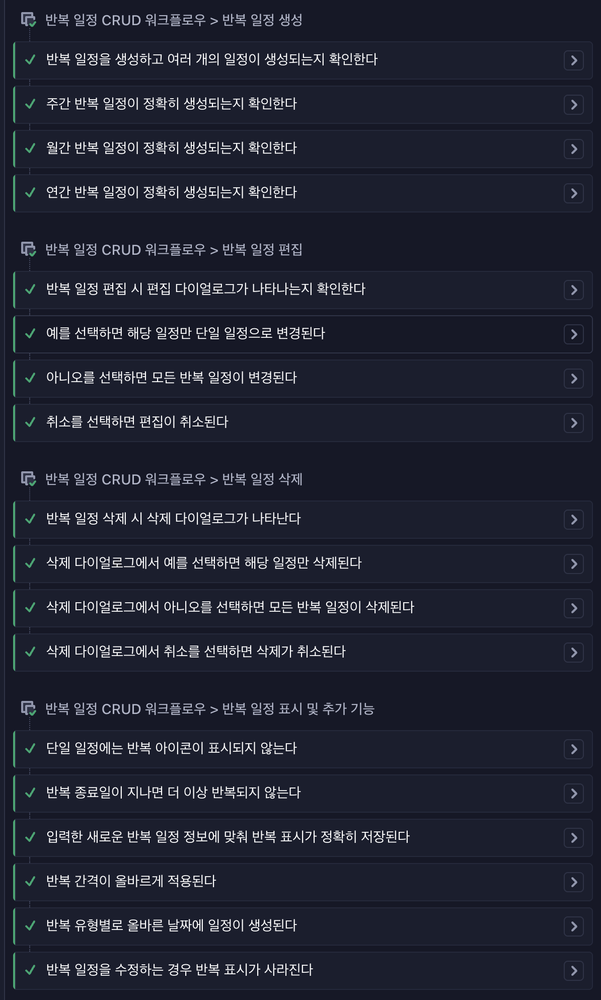

# 과제 3

### 필수 스펙

- 드래그 앤 드롭(D&D) 기능 개발
  - [x] 캘린더의 일정을 마우스로 끌어 다른 날짜나 시간으로 옮기는 기능을 구현합니다.
- 날짜 클릭으로 일정 생성 기능 개발
  - [x] 캘린더의 비어있는 날짜 셀을 클릭하면, 해당 날짜가 자동으로 폼에 채워지도록 하세요.

## 기본 과제

필수 스펙 개발과 E2E, 시각적 회귀 테스트를 모두 작성해주세요.

### 기본과제 제출

- 아래 작성된 E2E 테스트 작성은 필수입니다. 추가로 작성하고 싶다면 작성해주세요.
- 여기서 말하는 전반은 Create, Read, Update, Delete 모두에 해당합니다.

1. [x] 기본 일정 관리 워크플로우 전반을 검증하세요.
       `cypress/e2e/basic-flow/basic_crud.cy.ts`
2. [x] 반복 일정 관리 워크플로우 전반을 검증하세요.
       `cypress/e2e/recurring-flow/recurring_crud.cy.ts`
3. [x] 일정 겹침 처리 방식에 대해 검증하세요.
       `cypress/e2e/exception-flow/duplicate.cy.ts`
4. [x] 알림 시스템 관련 노출 조건에 대해 검증하세요.
       `cypress/e2e/basic-flow/noti.cy.ts`
5. [x] 검색 및 필터링 전반에 대해 검증하세요.
       `cypress/e2e/basic-flow/search_filtering.cy.ts`

- 아래 시각적 회귀 테스트는 필수 입니다. 추가로 작성하고 싶다면 작성해주세요.

1. [x] 타입에 따른 캘린더 뷰 렌더링
       `src/stories/calendar/CalendarView.stories.tsx`
2. [x] 일정 상태별 시각적 표현
       `src/stories/event/EventList.stories.tsx`
3. [x] 다이얼로그 및 모달
       `src/stories/event/EventForm.stories.tsx`
4. [x] 폼 컨트롤 상태
       `src/stories/event/EventForm.stories.tsx`
5. [x] 각 셀 텍스트 길이에 따른 처리
       `src/stories/calendar/DayCell.stories.tsx`

## 심화 과제

테스트 전략 작성해보기의 내용을 참고해서 지금까지 작성했던 프로젝트에 대해 테스트 전략을 구상해보세요.

### 심화 과제 제출

- [x] 내가 생각한 최적의 테스트 전략은 무엇인지, 그리고 그 이유를 작성해주세요.
- [x] 팀원들이 합의한 최적의 테스트 전략은 무엇인지, 그리고 그 이유를 작성해주세요.
- [x] 그 전략에 맞춰 추가한 테스트는 무엇인지 나타내주세요.

---

### [심화과제]

**현재 프로젝트 상황**
신규 프로젝트가 아닌, 이미 운영 중인 레거시 코드를 개선하고 신규기능들을 계속 추가되어야 하는 상황이라고 생각했습니다.

- 남이 구현한 코드 + 파악하기 힘든 코드 구조
- 컴포넌트와 훅이 명확하게 분리되지 않은 상태
- 리팩토링은 필요하지만 기존 기능이 무너지면 안 됨

이러한 상황에서 단위 테스트만으로는 프로젝트를 검증하기 어렵다고 판단했고, 다음과 같은 우선순위로 테스트 전략을 수립했습니다

1. **통합 테스트 (최우선)**: 현재 서비스의 기능이 정상 동작하는지 검증하는 기준점 마련

   - 리팩토링 시 전체 기능 단위의 안전망 역할
   - 컴포넌트가 분리되지 않은 현재 상태에서 가장 효과적인 검증 방법
   - 리팩토링 후 컴포넌트/훅 단위 테스트로 점진적 전환 가능

2. **단위 테스트 (엣지 케이스 중심)**: 예외 상황 및 경계값 검증

   - 날짜 관련 엣지 케이스 (31일, 윤년, 연도 경계 등)
   - 신규 기능의 단순 로직 검증 (날짜 클릭 시 폼 채우기 등)
   - 반복 일정의 예외 케이스 (부분 수정, 전체 수정 등)

3. **E2E 테스트/시각적 회귀테스트**: 핵심 사용자 워크플로우 검증
   - 사용자 관점의 전체 시나리오 보장
   - 통합테스트와 유사한 수준으로 중요하지만 기본 과제에서 각자 구현이 진행되었기 때문에 우선순위를 조금 낮추었습니다.

**통합 테스트**를 가장 우선으로 잡은 이유는 현재 코드는 조금만 수정해도 사이드 이펙트가 발생하는 상태입니다. 전체 기능이 정상 동작하는지 먼저 보장해야 안전하게 리팩토링과 기능 추가가 가능하다고 생각되었고,
**단위 테스트는 엣지 케이스 중심**으로 구성하여 컴포넌트/훅 단위 테스트가 불가능한 현재 구조에서는 예외 케이스 검증에 집중하는 것이 효율적으로 보였습니다. 지속적으로는 통합 테스트로 안전망을 확보한 후, 리팩토링하면서 컴포넌트/훅 단위 테스트를 점진적으로 추가하는 방향입니다. 또한 신규기능이 추가됨에 있어 팀원들간 상세구현이 다른것을 확인했고(날짜 클릭시 이벤트 폼에 날짜 입력 -> 다른 날짜 클릭하면 날짜 변경된다/아니다, 등) 이부분이 스펙형태의 테스트 케이스로 포함되어야 한다고 생각했습니다.

이러한 내용으로 다음과 같은 테스트 전략을 세웠습니다.

#### 테스트 전략

**핵심 원칙**

1. **통합 테스트를 기준점으로 삼기**: 현재 서비스의 기능이 정상 동작하는지 검증
2. **예외 케이스 강화**: 반복 일정 등 복잡한 로직의 엣지 케이스 집중 테스트
3. **테스트하기 좋은 구조로 점진적 개선**: 기능 단위로 폴더 구조 분리, 수정 시 해당 영역 테스트 추가
4. **CI/CD 파이프라인 강화**: 배포 전 강제 테스트 실행 (Husky 활용)

##### 테스트 전략 근거

1. **레거시 코드의 특성 고려**

   - 현재 코드는 컴포넌트가 명확히 분리되지 않아 단위 테스트만으로는 신뢰성 확보가 어렵습니다.
   - 통합 테스트로 전체 기능을 먼저 보장하고, 리팩토링하면서 단위 테스트를 추가하는 것이 현실적입니다.

2. **효율성과 실행 가능성**

   - 모든 코드를 리팩토링한 후 테스트를 작성하는 것은 비현실적입니다.
   - 현재 상태에서 작성 가능한 테스트부터 시작하고, 점진적으로 개선하는 것이 효율적입니다.

3. **팀의 실제 요구사항 반영**

   - "조금만 수정해도 사이드 발생"하는 현재 상황에서는 테스트가 필수입니다.
   - 최소한 테스트 코드라도 구조를 만들어 안전망을 확보하는 것이 우선입니다.

4. **장기적 유지보수 고려**
   - 기능 단위로 폴더 구조를 분리하고, 수정하는 부분은 해당 영역 테스트를 추가하는 방식으로 점진적 개선이 가능합니다.
   - CI/CD로 테스트를 강제하여 코드 품질을 지속적으로 유지할 수 있습니다.

#### 테스트 전략에 맞춰 추가한 테스트

**테스트 인프라 개선**

- **폴더 구조 개선**: 기능 단위로 테스트 파일 분리 (`basic-flow`, `recurring-flow`, `exception-flow`)
- **CI/CD 파이프라인**: Husky를 활용한 push 전 자동 테스트 실행. **테스트 자동화**영역으로 git action 사용에 권한 제한이 있어 huskey pre-push를 사용해 vitest, chromatic을 자동으로 수행하도록 하였습니다.

**통합 테스트 (기능 단위 검증)**

1. **반복 일정 부분 수정 검증**

   - 반복 일정 중 하나만 수정(또는 삭제) 시 나머지는 그대로인지 확인
   - 반복 일정 CRUD 중 예외 케이스 부분 강화

2. **반복 일정 전체 수정 검증**

   - 모든 반복 일정 수정 시 해당하는 전체 반복 일정이 수정되었는지 확인

3. **입력 폼 상태 관리 검증**
   - 입력 폼이 입력된 상태에서 캘린더 날짜 클릭 시 폼의 날짜 변경 동작 확인
   - 사용자 경험 관점의 상태 관리 검증

**단위 테스트 (엣지 케이스 중심)**

4. **날짜 클릭 시 폼 채우기 검증**

   - 캘린더에서 셀을 선택 시 이벤트 생성 폼에 해당 날짜가 노출되는지 확인

5. **날짜 관련 엣지 케이스 검증**

   - 31일로 매달 일정 생성 시 31일이 없는 달은 건너뛰는지 확인
   - 윤년 처리가 올바르게 동작하는지 확인
   - 반복 일정 선택 시 연도 경계 처리 검증 (31일, 윤년)

6. **뷰 전환 동작 검증**
   - 뷰(월별 ↔ 주별) 변경 시 해당 월의 1주차로 이동되는지 확인

**UI 테스트 (시각적 회귀)**

7. **드래그 앤 드롭 동작 검증**

   - 마우스로 일정 이동 시 드랍된 곳으로 일정이 이동되는지 확인
   - 드래그 중 마우스가 캘린더를 벗어나면 일정 수정이 취소되는지 확인

8. **캘린더 셀 오버플로우 처리** 

   - 캘린더에 일정을 넘치게 등록하면 셀 영역이 늘어나는지 확인
   - 많은 일정이 있을 때 UI가 깨지지 않는지 검증

9. **알림 표시 동적 업데이트**
   - 알림 표시된 일정이 다른 날짜로 이동되면 알림 표시가 업데이트되는지 확인

**추가 고려 사항 (향후 구현 예정)**

- **자정 넘어가는 일정 검증**: 2일에 걸친 일정 처리 (기능 구현 필요)
- **반복 일정 드래그 시 겹침 경고**: 드래그로 다른 일정과 겹칠 때 경고 (기능 구현 필요)
- **알림 개수 제한**: 알림 최대 개수 제한 및 UI 처리

**현재 레거시 코드 상태에서는 통합 테스트를 중심으로 안전망을 확보하고, 엣지 케이스는 단위 테스트로 보완하는 전략이 가장 효율적입니다. 리팩토링을 진행하면서 컴포넌트/훅 단위 테스트를 점진적으로 추가하여 장기적으로 테스트 피라미드 구조를 완성할 계획입니다.**

---

## 과제 셀프회고

### 기술적 성장

테스트 구성을 위해 cypress, storybook, chromatic 전부 처음 사용해 보았는데,
**Storybook + Chromatic**은 설정이 간단하고 직관적이어서 시각적 회귀 테스트를 빠르게 구축할 수 있었습니다. 특히 기존 기능과 단위 테스트가 이미 구현되어 있는 상태에서 AI로 시각적 테스트를 빠르게 구현할 수 있었습니다. 시각적 회귀테스트에서는 어떻게 테스트 데이터를 구성할지가 고민이었는데 시간상, 그리고 지속적으로 동일한 스냅샷을 위해서는 기능 외에 데이터는 고정되어야 한다고 생각되어 mock 데이터를 사용하였습니다.
**Cypress**는 E2E 테스트에서 사용하였는데 command 지정과 같은 각종 편의 설정을 제공하는 것으로 보였고 vitest와 유사하여 단위테스트 여러개를 이어서 E2E테스트로 작성하는 듯한 느낌이었습니다.
테스트 케이스를 만들어내며 엣지/예외 케이스가 종종 발견되었는데 이런 부분들은 한번은 몰라도 지속 운영되는 서비스라면 놓치기 쉬운 부분이라 테스트가 있으면 좋겠다(누군가 구현해줬으면..)싶었습니다.
마지막으로 테스트 flow를 위해 Git Action이 제한적인 환경에서 Husky를 대안으로 선택했는데 생각보다 Husky가 가벼운 설정으로 동작하는걸 보고 확장성이 좋아서 놀라기도 했고..또 붙여볼만한 다른 pre-commit 들을 찾아봐야겠다 싶었습니다.

팀원들과 테스트 전략에 대해 논의하며 가장 크게 느낀 점은 무조건 단위 -> 통합 -> E2E -> 시각화 순서가 아닐 수 있다는 점, 일부 테스트는 과감하게 생략해야 하고 레거시에서는 오히려 E2E에 힘을 줘야겠다는 고민도 들었습니다.

3주간의 테스트 코드를 실행하며, 있으면 좋은데 내가 하기엔 너무... 반복적이고 손이 많이 가는 일이 많아 보였고 일단 도입 후에도 테스트코드를 유지하기 위한 비용(+노력)이 얼핏보기에도 꽤 들것 같았습니다. 항상 급한 ASAP과 테스트 사이에서 우선순위가 밀리는게 다시한번 눈에 보였고.. 도입하게 되면 초반에 구조를 잘 잡아야되겠다 싶었던 3주였습니다. 그래도 평소 외면해왔던 테스트코드와 테스트 툴 들을 접할 수 있는 기회여서 좋았습니다.

### 코드 품질

테스트 코드를 구현하는데 있어서는 반복되고 노가다적인 작업이 많아 AI를 적극 활용하였는데, AI가 딴길로 새거나 테스트코드 내에서 실제로 구현하고 있지는 않은지에 대해 두번, 세번씩 확인하였습니다.

기본적인 테스트 케이스 외에도 엣지 케이스를 테스트에 포함시키기 위해 노력했습니다.

**특히 만족스러운 구현**

1. **기능 단위 테스트 구조화**

   - E2E 테스트를 `basic-flow`, `recurring-flow`, `exception-flow`로 명확하게 분리하여 테스트 목적을 직관적으로 파악할 수 있도록 구조화했습니다.

2. **엣지 케이스 다양화**

   **기본 일정 관련** (`basic-flow/basic_crud.cy.ts`)

   - 기본적인 CRUD의 다양한 케이스를 포함하였습니다.
    

   **알림 시스템** (`basic-flow/noti.cy.ts`)
   
   - 현재 시간을 기준으로 11분 후 이벤트를 생성하고 실제로 1분을 기다려 알림 메시지를 확인하는 등 실사용처럼 구성하려고 노력했습니다.
```
describe('알림 노출', () => {
    it('알림 시간이 도래하면 알림 메시지가 표시된다', () => {
      const title = '임박 알림 회의';

      // 현재 시간 가져오기
      const now = new Date();
      const futureTime = new Date(now.getTime() + 11 * 60 * 1000); // 현재 시간 + 11분

      //.. 생략 .. 날짜처리관련

      saveSchedule({
        title,
        date,
        startTime,
        endTime,
        description: '알림 도착 확인',
        location: '회의실 B',
        category: '업무',
        repeat: { type: 'none', interval: 0 },
        notificationTime: 10,
      });

      // 알림이 나타날 때까지 기다리기 (최대 1분)
      cy.get('[role="alert"]', { timeout: 60000 })
        .should('have.length', 1)
        .and('contain', `10분 후 ${title} 일정이 시작됩니다.`);
    });
```

   

   **검색 및 필터링** (`basic-flow/search_filtering.cy.ts`)
   
   

   **일정 겹침 처리** (`exception-flow/duplicate.cy.ts`)
   - 일정이 겹치는 다양한 케이스에 대해 처리하고 예외(반복)도 테스트케이스로 추가하였습니다.
   

   **반복 일정** (`recurring-flow/recurring_crud.cy.ts`)
   - 반복일정은 CRUD를 기본으로 하여 해당 케이스마다 예외를 추가하였습니다.
   

**리팩토링이 필요한 부분**

테스트 코드 관점에서.

1. **테스트 코드 중복 제거**

   - 현재 E2E 테스트에서 일정 생성 폼 작성, 날짜 선택 등 반복되는 패턴이 많습니다.
   - 독립적인 테스트를 위해 커스텀 Cypress 커맨드(`cy.createEvent()`, `cy.selectDate()` 등)사용을 지양했는데 마지막에 갈수록 필요성을 느꼈고, 어디까지 독립성을 유지해야 할지도 고민되는 부분이었습니다.

2. **테스트 데이터 관리 개선**

   - 각각의 테스트에서 조건을 만족시키기 위해 단위/통합/E2E/시각적 회귀 테스트마다 다른 테스트 데이터를 운영하고 있는데 이부분도 개선이 필요합니다.
     (예를 들어 단위테스트는 기댓값을 만족시켜야 하므로 input - output을 동일하게 유지해야 하고, 시각적 테스트는 추후 배포되는 스냅샷과 비교되어야 하므로 날짜 등이 아예 고정되어야 함)

### 학습 효과 분석

**가장 큰 배움이 있었던 부분**

- **테스트 피라미드의 실전 적용**: 단위 테스트, 통합 테스트, E2E 테스트, 시각적 회귀 테스트를 실제로 구현하며 각 레벨의 역할과 중요성을 체감했습니다. 특히 E2E 테스트는 비용이 높지만 사용자 관점의 신뢰도를 제공한다는 점을 이해했습니다.
- **Storybook**: 단순 문서화 도구가 아닌 개발 워크플로우와 테스트 전략의 핵심 도구로 활용할 수 있다는 것을 깨달았습니다. 그치만 아직 사용법은 잘 모르겠는..
- **테스트 격리의 중요성**: 독립적으로 실행 가능한 테스트 작성의 중요성과 MSW를 통한 구현 방법을 학습했습니다. 테스트 간 의존성이 없어야 유지보수가 쉽고 디버깅이 용이하다는 것을 체감했습니다. 중요한건 알았는데 어떻게 잘 해야 할지는 아직 모르겠습니다.

**추가 학습이 필요한 영역**

- 각종 테스트 툴에 익숙해지고, config, 다양한 테스트 및 툴 간의 장점 최대 활용화하여 테스트 수행하기
- Chromatic의 고급 기능을 활용한 더 포괄적인 테스트 전략
- 테스트 커버리지 측정 및 분석 도구 활용 방법

**실무 적용 가능성**

- Chromatic이 직관적으로 비교가되서 좋았지만 실무에서는 E2E, 통합테스트가 더 효과적일 것 같았습니다. 오히려 Storybook은 스펙용도로 사용하고, E2E테스트를 통해 개발하면서도 계속 테스트가 가능할 것 같았습니다.
- 또한 CI/CD에 테스트를 포함하는 구성은 (자동화+강제)된다는 점에서 용이해보였는데, 도입하려면 테스트코드 작성이 선행되어야 한다는 점이.. 조금 부담으로 느껴졌습니다.
  git action등을 사용하면 infra팀 등의 협업이 필요한데, Husky를 대안으로 사용가능 해 보였습니다.

### 과제 피드백

**좋았던 부분**

- E2E와 시각적 회귀 테스트를 모두 경험할 수 있어 테스트 전략의 전체 그림을 이해하는 데 도움이 되었습니다.
- Storybook과 Chromatic 등 실질적인 툴을 사용해 볼 수 있는 기회였습니다.
- 테스트를 작성하기 위해 오히려 기능과 예외상황에 대해 더 많은 고민을 하게 되는 것 같았습니다.

**과제에서 모호하거나 애매했던 부분**

- 어떻게 시작해야 할지 막막했습니다.....

## 리뷰 받고 싶은 내용

### 테스트 데이터 관리 전략

vitest 등에서는 기대값과 일치하면 되서 지정해서 사용이 가능했는데, e2e테스트나 스냅샷은 임의의 데이터(e2e.json)을 기반으로 하다보니 이번달 -> 다음달 등 전체적인 달력이 이동하면 테스트 화면 자체가 달라져 비교 시 다르다고 나올 것 같습니다. storybook에서 일부는 아예 데이터를 인라인으로 사용했는데, 이렇게 날짜 등에 따라 화면이 변경되는 경우 데이터 처리를 어떻게 해야할지 궁급합니다.
또한 특히 데이터 일관성과 테스트 독립성 사이의 균형을 어떻게 맞춰야 할지 조언 부탁드립니다.

### 각 테스트마다 데이터를 다르게 사용하는 것에 관하여

각각의 테스트에서 조건을 만족시키기 위해 단위/통합/E2E/시각적 회귀 테스트마다 다른 테스트 데이터를 사용했는데 어떻게 구성되어야 할지 궁금합니다.
예를 들어 단위테스트는 기댓값을 만족시켜야 하므로 input - output을 동일하게 유지해야 하고, 시각적 테스트는 추후 배포되는 스냅샷과 비교되어야 하므로 날짜 등이 아예 고정되어야 함

### 테스트 관리 관련

위 내용에 이어서, 사실 테스트 코드를 짜는 것보다 테스트를 유지하는게 더 힘들다고 생각됩니다. 실무에서는 어느 시점에 테스트코드 수정이 발생하고, 테스트를 지속 관리하기 위해 테스트 데이터 등은 어떻게 관리하시는지 궁금합니다.(개발DB/검수DB가 있는데 따로 또 테스트DB를 운영하는 걸까요?) 테스트의 기대치는 고정된 상수가 많아서 데이터가 변경되면 테스트 코드가 계속 수정되며 오히려 신뢰성이 떨어질 것 같습니다.

### 테스트 도입 방안

TDD로 개발이 시작되는 경우도 있겟지만, 현실적으로는 서비스가 있고 필요에 따라 테스트가 도입되는 경우가 더 많다고 생각됩니다. 만약 리팩토링과 함께 테스트 코드를 넣게 된다면 통합테스트 -> 리팩토링 + 단위테스트 이 순서가 맞을지 궁금합니다.

### 시각적 회귀 테스트 커버리지 적정성

Storybook Stories에서 각 컴포넌트의 다양한 상태를 커버하려고 했는데, 현재 작성한 Stories가 실무에서 요구되는 수준의 커버리지를 충족하는지 궁금합니다. 특히 `DayCell.stories.tsx`에서 8개의 Story를 작성했는데, 이 정도가 적절한지 아니면 과도한지 피드백 부탁드립니다. 실무에서는 보통 컴포넌트당 몇 개 정도의 Story를 작성하는 것이 적절한가요?
